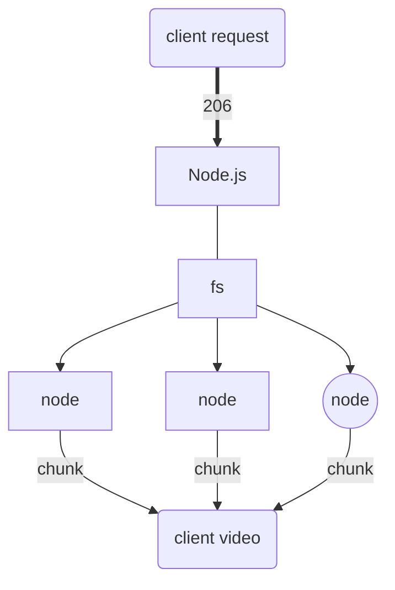

# CustomVideo

[Vanlina JavaScript 30](https://javascript30.com/)의 11번 토픽을 변형하여 기본적인 Video 태그를 숙지하고 기본 컨트롤러가 아닌 Customize화 하여 Video Player를 제작하고자 했다. 

또한, 사용자에게 제공하는 Video를 스트리밍 기법을 이용하여 제공할 수 있는 방법을 찾아 구현해보고자 했다. 

## Flowchart





## Discription

사용자가 서버에 동영상을 요청할때 Header값을 206 request로 보냈고, 서버에서 Node.js의 기본 모듈인 **fileSystem**을 통해 동영상을 
스트리밍 형식으로 클라이언트에 response 해주었다. 

프론트에서는 비디오 기본기능을 수행하는 controller를 제작해서 video 태그아래에 부착했고, 전체화면에서 강제적으로 생성되는 Shadow DOM을 가려서 custom controller만 사용할 수 있도록 만들었다. 


#### Streaming


`fs.createReadStream(path, {start, end})` 를 이용하여 파일 전체를 불러오는 형식이 아닌 chunk단위로 끊어서 스트리밍해오는 방식을 이용하고자 했다.  

클라이언트 측에 response는 `file.pipe(res)`를 이용하여 cutsom event를 구축한 것이 아닌, read & write를 연결하여 간단하게 해결하였다.


#### 206 Header 데이터 전송
```
const head = {
   'Content-Range': `bytes ${start}-${end}/${fileSize}`,
   'Accept-Ranges': 'bytes',
   'Content-Length': chunksize,
   'Content-Type': 'video/mp4',
}
```

header값으로 전송할때 chunk단위로 나뉘어진 range를 전송하게 되고, front에서는 전달된 range값에 따라 데이터를 받아오게 된다. 

#### CustomController 

전체화면 : ```webkitRequestFullScreen()``` <br>
video 내장 요소들 : ```play(), pause(), muted, volume, currentTime, seekable.end(0)``` <br>
event : input tag event, click event


### Reference 

https://medium.com/@daspinola/video-stream-with-node-js-and-html5-320b3191a6b6 - Streaming 


https://www.w3schools.com/tags/ref_av_dom.asp - Video elements


https://css-tricks.com/custom-controls-in-html5-video-full-screen/ - Full screen mode 


https://developer.mozilla.org/ko/docs/Web/HTTP/Status/206